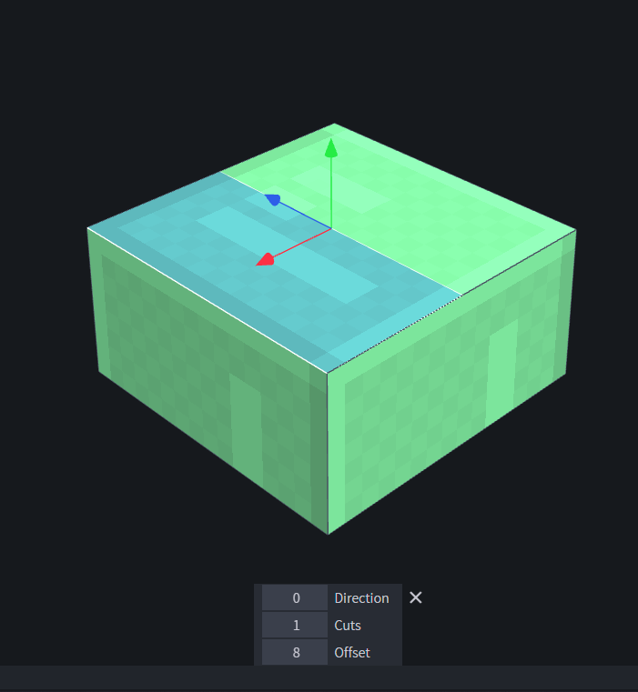

# Blockbench Cut Face

#### Usage
- Download plugin file [cut_face.js](cut_face.js "download") and install
- Select face you want to cut
- Use any of the following methods
  - Top Menu -> Edit -> Cut Face
  - Press F3 to open action control -> Search "Cut Face" and click it
  - Add the Cut Face button to your toolbar
  - Set a keybind for it

